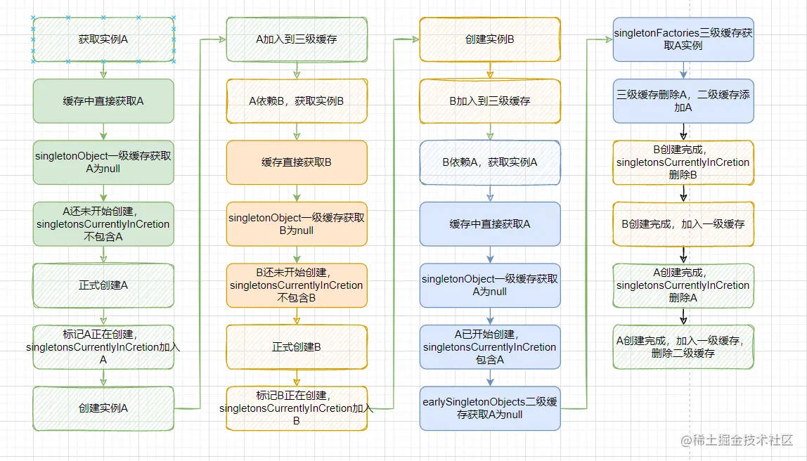

Spring 根据我们提供的配置类和配置文件,解析其中的内容,得到管理的Bean信息以及其中的关联,并提供很多拓展点供我们定制
Spring 得到Bean信息后通过反射创建Bean实例,组装Bean之间的依赖关系,会穿插原生的或我们定义的相关PostProcessor来改造Bean

IOC：
Spring 创建的对象实例,叫作 Bean
Spring 将创建好的单例 Bean 放在一个 Map 中，通过名字或者类型我们可以获取这些 Bean

AOP：
标记注解,写个配置,将配置的类/方法下的逻辑和配置的逻辑结合起来

@Transactional -> 添加事务支持

@ConditionalOnMissingBean(class) -> 当没有指定Bean的时候注入

三级缓存：
singletonObject：一级缓存
